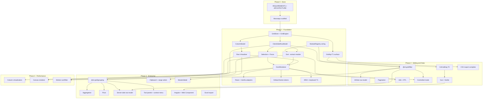

# ol-grid — Implementation Plan & Track

> **Authoritative product spec:** [REQUIREMENTS.md](./REQUIREMENTS.md)  
> **Architecture:** [ARCHITECTURE.md](./ARCHITECTURE.md)  
> **Feature specs:** [requirements/README.md](./requirements/README.md)  
> **Last audited:** 2026-06-27 (custom cell editors T2-ED-06 — React portals + vanilla `CellEditor` host; `registerCellEditor`)  
> **Tests:** 306 passing · 306 total · 66 test files · **Packages shipped:** 14 (`core`, `dom-renderer`, `sort`, `filter`, `pagination`, `infinite-row-model`, `locale-en`, `tempo`, `drag-and-drop`, `react`, `vanilla`, `vue`, `svelte`, `visual-regression`)  
> **CI:** Node 24 · pnpm 11.8.0 · build · typecheck · test · bundle-size gate · axe-core (vanilla demo) — `perf-100k` manual only, not in CI

---

## Executive Summary

| Metric | Value |
|--------|-------|
| **Current phase** | **Phase 1 — Foundation (MVP)** largely complete; **Phase 2 — Editing & Data** in progress (Sprints 1–7 done) |
| **Tier 1 completion** | **~76%** (core T1 feature set + quality gates shipped; API docs + migration parity remain) |
| **Tier 2 completion** | **~85%** (custom filter host + doesFilterPass; visual regression baseline captured; migration polish remain) |
| **Tier 3 completion** | **~0%** (specs only) |
| **Overall v1 scope** | **~32%** (weighted across T1–T3) |

**What works today:** A developer can mount a virtualized grid in React, vanilla, Vue, or Svelte with 1k+ rows (`benchmarks/perf-100k` manual workspace), single-column header sort with `comparator` and imperative `setSortModel` / `getSortModel`, row selection (single/multi + checkbox column + header select-all + shift-range), pinned-left and pinned-right columns, column resize, `applyColumnState`, flex fill-remaining columns, quick filter, text/number/date column filters with floating filter row, basic and provided cell editors with Tab navigation and `valueParser`, arrow-key + Home/End/Page focus with `ensureIndexVisible`, custom cell renderers (string registry + React portals), CSV export with params, `applyTransaction`, infinite row model against a mock REST datasource, loading/error/no-rows overlays, and controlled `sortModel` / `filterModel` / `rowSelection` in adapters. Monorepo builds with Turbo; CI runs build, typecheck, tests, bundle-size gate, and axe-core on the vanilla demo.

**Critical gaps before Tier 1 exit:** API docs (`GridOptions`, `GridApi`, Tier 1 events), AG Grid getting-started tutorial parity (≤20% mapping changes), 100k perf benchmark in CI.

**Critical gaps before Tier 2 exit (Sprint 8–10):** RTL layout, migration guide polish + per-method TypeDoc examples.

---

## Phase 0: Done — Scaffold & Specs

| Deliverable | Status | Notes |
|-------------|--------|-------|
| pnpm + Turbo monorepo | Done | `package.json`, `turbo.json`, `vitest.config.ts` |
| `@ol-grid/core` package | Done | `GridEngine`, `GridStore`, `ColumnModel`, `ClientSideRowModel`, sort, selection, virtualizer, CSV, quick filter |
| `@ol-grid/dom-renderer` package | Done | `DomRenderer`, `theme.css`, scroll virtualization, resize, edit host |
| `@ol-grid/react` package | Done | `OlGrid`, `useOlGrid`, `useSyncExternalStore` |
| `@ol-grid/vanilla` package | Done | `createGrid(host, options)` |
| Examples | Done | `examples/react`, `examples/vanilla`, `examples/vue`, `examples/svelte`, `examples/infinite` — sort, select, filter, edit, quick filter, CSV |
| REQUIREMENTS.md | Done | Tiers, NFRs, exit criteria §8 |
| ARCHITECTURE.md | Done | Layers, packages, phased roadmap §10 |
| 30 feature requirement docs | Done | `requirements/*.md` + index |
| CI / benchmarks / docs site | Partial | GitHub Actions: build, typecheck, test, bundle-size gate, axe-core on vanilla demo (Node 24, pnpm 11.8.0). `benchmarks/perf-100k` manual + `bundle-size.mjs` in CI. TypeDoc scaffold (`pnpm docs` → `docs/api/`); docs site not started |

---

## Phase Tracks (ARCHITECTURE.md §10)

### Phase 1 — Foundation (MVP) · **NEARING EXIT (~76%)**

Target: virtualized, sortable, selectable grid; React + vanilla; default theme; core API.

| Workstream | Target packages | Status |
|------------|-----------------|--------|
| GridStore + GridEngine lifecycle | `@ol-grid/core` | **Done** — mount/destroy, `setGridOption`, `addEventListener` |
| Column model (defs, pin-left/right, resize, flex) | `@ol-grid/core` | **Partial** — pin-left/right, resize, flex, `applyColumnState`, column groups (`buildHeaderRows`), drag reorder within pin region |
| CSRM + quick filter | `@ol-grid/core` | **Partial** — `applyTransaction`; column filters via `@ol-grid/filter` module |
| Row virtualization | `@ol-grid/core` + `@ol-grid/dom-renderer` | **Partial** — fixed height, overscan 5, `ensureIndexVisible`; no dynamic row height |
| Sort (single column) | `@ol-grid/sort` | **Done** (T1) — `comparator`, `setSortModel`/`getSortModel`, `aria-sort`; multi-column sort (T2) done Sprint 9 |
| Selection + focus | `@ol-grid/core` + dom-renderer | **Done** (T1) — select-all header checkbox, shift-range, `selectAll`/`deselectAll` API |
| DOM renderer + theme | `@ol-grid/dom-renderer` | **Partial** — left/right pin, custom renderers, loading/error/no-rows overlays; dark/system theme tokens (Sprint 8); Alpine theme package T2 |
| React + vanilla adapters | `@ol-grid/react`, `@ol-grid/vanilla` | **Partial** — options sync, `"use client"`, React cell-renderer portals; full options surface T2 |
| ModuleRegistry skeleton | `@ol-grid/core` | **Done** — register/has + wired on engine create; sort/filter as modules |

### Phase 2 — Editing & Data · **IN PROGRESS (~58%)**

Target: AG Grid Community parity for admin grids; Vue + Svelte; filtering; infinite row model.

| Workstream | Target packages | Status |
|------------|-----------------|--------|
| Cell editing (full T2) | core + dom (→ `@ol-grid/edit` planned) | **Partial** — text + number/select/date/largeText editors, Tab nav, `valueParser`, custom `CellEditor` host + React editor portals (T2-ED-06) |
| Column filters + floating filters | `@ol-grid/filter` | **Done** (T2 core) — text/number/date filters, `setFilterModel`, header menu, floating row |
| Infinite row model | `@ol-grid/infinite-row-model` | **Done** (T2) — datasource contract, block cache, mock REST demo |
| Pagination mode | `@ol-grid/pagination` | **Done** (T2 CSRM) — pipeline stage, panel UI, API; SSRM server pagination T3 |
| CSV export (full params) | `@ol-grid/core` | **Done** (T2) — `getDataAsCsv`, `onlySelected`, `processCellCallback` |
| Vue + Svelte adapters | `@ol-grid/vue`, `@ol-grid/svelte` | **Partial** (T2) — composable/component, `bind:api`, controlled slices, column-filter + pagination demos; cell-renderer portals still open |
| i18n + RTL | `@ol-grid/locale-*` | **Partial** — `@ol-grid/locale-en` + `localeText`; RTL not started |
| Controlled mode per state slice | adapters + core | **Done** — `sortModel`, `filterModel`, `rowSelection` controlled in React/Vue/Svelte |
| Column groups, drag reorder, auto-size API | `@ol-grid/core` | **Partial** — `buildHeaderRows`, `autoSizeAllColumns` / `sizeColumnsToFit`, `moveColumn` + header drag UI (within pin region; cross-group reorder deferred) |

### Phase 3 — Scale & Enterprise Patterns · **NOT STARTED**

Target: grouping, SSRM, clipboard, tool panels, Angular, Web Component.

| Workstream | Target packages | Status |
|------------|-----------------|--------|
| Row grouping + tree + pivot + agg | `@ol-grid/grouping`, `@ol-grid/pivot` | Spec only |
| Server-side row model | `@ol-grid/server-side-row-model` | Spec only |
| Clipboard + range selection | `@ol-grid/clipboard` | Spec only |
| Context menu + tool panels | `@ol-grid/context-menu`, `@ol-grid/tool-panels` | Spec only |
| Master/detail | `@ol-grid/master-detail` | Spec only |
| Excel export | `@ol-grid/excel-export` | Spec only |
| Angular adapter | `@ol-grid/angular` | Not started |
| Web Component | `@ol-grid/web-component` | Not started |

### Phase 4 — Performance Tier · **NOT STARTED**

Target: canvas renderer, column virtualization, worker offload.

| Workstream | Target packages | Status |
|------------|-----------------|--------|
| Canvas renderer + companion a11y DOM | `@ol-grid/canvas-renderer` | Spec only |
| Column virtualization (500+ cols) | core + renderers | Not started |
| Web Worker sort/filter | `@ol-grid/core` worker entry | Not started |

---

## Per-Feature Status (All 30)

| Feature | Tier | Requirement doc | Status | Key REQ gaps | Next actions | Package |
|---------|------|-----------------|--------|--------------|--------------|---------|
| Core engine | T1–T3 | [core-engine.md](./requirements/core-engine.md) | **Partial** | Pipeline plugin hooks; `columnApi` null; immutable CSRM mode | Expand `PluginHost`; expose `columnApi` stub | `@ol-grid/core` |
| Grid API & events | T1–T3 | [grid-api-and-events.md](./requirements/grid-api-and-events.md) | **Partial** | Per-method TypeDoc examples; some T2/T3 API methods | Complete TypeDoc examples; publish docs site | `@ol-grid/core` |
| Plugin & module system | T1–T3 | [plugin-module-system.md](./requirements/plugin-module-system.md) | **Partial** | Per-grid module scope (MOD-REG-05–08); filter not lazy-loaded in all paths | Per-grid registry scope; document module registration | `@ol-grid/core`, `@ol-grid/*` |
| Column model | T1–T2 | [column-model.md](./requirements/column-model.md) | **Partial** | Cross-group drag reorder; controlled `columnState` | Controlled `columnState`; cross-group drag | `@ol-grid/core` |
| Client-side row model | T1–T2 | [client-side-row-model.md](./requirements/client-side-row-model.md) | **Partial** | Immutable mode; formal multi-stage pipeline registry | Immutable CSRM option; pipeline stage registry | `@ol-grid/core` |
| DOM renderer | T1–T3 | [dom-renderer.md](./requirements/dom-renderer.md) | **Partial** | Vue/Svelte cell-renderer portals; canvas companion DOM (T3) | Framework portal parity for Vue/Svelte | `@ol-grid/dom-renderer` |
| Virtualization | T1–T3 | [virtualization.md](./requirements/virtualization.md) | **Partial** | Dynamic row height; column virt (T3) | `getRowHeight` cache (T2); column virt (T3) | `@ol-grid/core`, renderers |
| Sorting | T1–T3 | [sorting.md](./requirements/sorting.md) | **Partial** (T1+T2 multi + `initialSort` + `postSortRows` + `accentedSort`) | SSRM pass-through (T3); worker offload (T3) | SSRM sort pass-through; worker offload | `@ol-grid/sort` |
| Selection | T1–T2 | [selection.md](./requirements/selection.md) | **Done** (T1) | Cell range selection (T3) | Range selection module (Tier 3) | `@ol-grid/core` |
| Keyboard navigation | T1–T3 | [keyboard-navigation.md](./requirements/keyboard-navigation.md) | **Done** (T1) | Tab between non-edit cells edge cases | Audit Tab vs edit-mode behavior | `@ol-grid/core`, dom-renderer |
| Theming | T1–T2 | [theming.md](./requirements/theming.md) | **Partial** | Alpine theme package; separate `@ol-grid/themes`; full token audit | Split `theme.css`; add Alpine package | `@ol-grid/dom-renderer`, `@ol-grid/themes` |
| Framework adapters | T1–T3 | [framework-adapters.md](./requirements/framework-adapters.md) | **Partial** | Angular/WC; Vue/Svelte cell-renderer portals | Sprint 15+ Angular/WC; Vue/Svelte portal parity | `@ol-grid/react`, `@ol-grid/vanilla`, `@ol-grid/vue`, `@ol-grid/svelte` |
| Accessibility | T1–T3 | [accessibility.md](./requirements/accessibility.md) | **Partial** | Live regions; full WCAG AA audit; canvas companion DOM (T3) | Live region for async updates; manual audit | core + renderers |
| Performance & bundle | T1–T3 | [performance-and-bundle.md](./requirements/performance-and-bundle.md) | **Partial** (bundle gate only) | 100k perf manual (`benchmarks/perf-100k`, not CI); 1M-row canvas (T3); perf regression CI (Should) | Add perf-100k to CI (Should); Sprint 19+ canvas | all packages |
| AG Grid migration | T1–T3 | [ag-grid-migration.md](./requirements/ag-grid-migration.md) | **Partial** | No `@ol-grid/compat-ag-grid`; full ColDef matrix | Expand migration guide; compat shim | `@ol-grid/compat-ag-grid` (planned) |
| Cell editing | T2 | [cell-editing.md](./requirements/cell-editing.md) | **Partial** | Full validation UX; Vue/Svelte editor portals | Polish blur paths; Vue/Svelte editor host | core + dom (→ `@ol-grid/edit`) |
| Filtering | T2–T3 | [filtering.md](./requirements/filtering.md) | **Done** (T2 core + custom) | Set filter (T3) | Set filter in Tier 3 | `@ol-grid/filter` |
| Infinite row model | T2 | [infinite-row-model.md](./requirements/infinite-row-model.md) | **Done** | — | Pagination alternative (Sprint 9) | `@ol-grid/infinite-row-model` |
| Pagination | T2 | [pagination.md](./requirements/pagination.md) | **Done** (T2 CSRM) | SSRM server pagination (T3); `paginateChildRows` with grouping (T3) | `paginateChildRows` with grouping (T3) | `@ol-grid/pagination` |
| Export (CSV/Excel) | T2–T3 | [export.md](./requirements/export.md) | **Done** (T2 CSV) | Excel module (T3) | `@ol-grid/excel-export` in Tier 3 | `@ol-grid/core` (CSV), `@ol-grid/excel-export` |
| Internationalization | T2 | [internationalization.md](./requirements/internationalization.md) | **Partial** | `@ol-grid/locale-en` shipped; RTL; hard-coded strings in some paths | RTL in dom-renderer; audit remaining strings | `@ol-grid/locale-*` |
| Clipboard | T2–T3 | [clipboard.md](./requirements/clipboard.md) | **Not started** | Ctrl+C/V; TSV/HTML; range selection dependency | Depends on range selection (T3); basic copy T2 | `@ol-grid/clipboard` |
| Row grouping | T3 | [row-grouping.md](./requirements/row-grouping.md) | **Not started** | Full REQ-RG-* pipeline stage | `@ol-grid/grouping` after CSRM pipeline extensible | `@ol-grid/grouping` |
| Tree data | T3 | [tree-data.md](./requirements/tree-data.md) | **Not started** | `getDataPath`, expand/collapse | Share grouping infra; path-based tree builder | `@ol-grid/grouping` |
| Aggregation | T3 | [aggregation.md](./requirements/aggregation.md) | **Not started** | sum/avg/min/max/count; group footers | Colocate with grouping module (OQ-AG-1) | `@ol-grid/grouping` |
| Pivoting | T3 | [pivoting.md](./requirements/pivoting.md) | **Not started** | Dynamic pivot columns; SSRM metadata | After grouping + column model dynamic cols | `@ol-grid/grouping` / `@ol-grid/pivot` |
| Server-side row model | T3 | [server-side-row-model.md](./requirements/server-side-row-model.md) | **Not started** | Lazy hierarchy; sparse store; stale response tokens | New package; mock server demo | `@ol-grid/server-side-row-model` |
| Context menu & tool panels | T3 | [context-menu-and-tool-panels.md](./requirements/context-menu-and-tool-panels.md) | **Not started** | Column/filter side panels; context menu plugin | `GridPlugin` host; sidebar UI | `@ol-grid/context-menu`, `@ol-grid/tool-panels` |
| Master/detail | T3 | [master-detail.md](./requirements/master-detail.md) | **Not started** | Nested grid; full-width detail rows | Dynamic row heights + nested engine lifecycle | `@ol-grid/master-detail` |
| Canvas renderer | T3 | [canvas-renderer.md](./requirements/canvas-renderer.md) | **Not started** | `drawCell` contract; hidden a11y DOM | Phase 4; benchmark 1M rows | `@ol-grid/canvas-renderer` |

---

## Dependency Graph

What blocks what — build in this order within each phase.

---

## Recommended Sprint Order

Assuming **2-week sprints**, one engineer (scale tasks horizontally when team grows).

### Sprint 1 — Tier 1 API & sort completeness
- [x] `setSortModel` / `getSortModel` on `GridApi` (REQ-SORT-04, T1-SORT-04)
- [x] `comparator` on `ColumnDef` + tests (T1-SORT-03)
- [x] `aria-sort` on column headers + sort indicator tests (T1-SORT-02)
- [x] `defaultColDef` merge (API-GO-06)
- [x] Fix **flex column layout** — Status column in demos should fill remaining center viewport (column-model viewport + dom-renderer width sync)

### Sprint 2 — Keyboard, focus, column state
- [x] Home / End / Page Up / Page Down (T1-SEL-03, A11Y-KB-*)
- [x] `ensureIndexVisible` when focus moves off-screen
- [x] `applyColumnState` / `getColumnState` on `GridApi` (T1-COL-06)
- [x] Pinned-**right** column region (T1-COL pin parity)
- [x] Header checkbox select-all (selection T1 polish)

### Sprint 3 — Renderers, modules, quality gates
- [x] Extract sort to `@ol-grid/sort`; wire `ModuleRegistry` on engine create (MOD-REG-*)
- [x] Custom cell renderer host + string key registry (T1-COL-05)
- [x] React framework cell renderer portal map (REQ-ADP-43)
- [x] `benchmarks/` + 100k-row manual workspace (T1-C-02 artifact; `perf-100k` not CI-gated)
- [x] axe-core on default demo in CI (T1 exit §8.1)
- [x] Bundle size gate: core + dom + react gzip ≤ 80 KB (T1-P-04)

### Sprint 4 — Editing T2 completion
- [x] `valueParser` on `ColumnDef`; validation / reject commit (T2-ED-03/04)
- [x] Tab / Shift+Tab between editable cells (T2-ED-02)
- [x] Provided editors: number, select (T2-ED-05)
- [x] `stopEditingWhenCellsLoseFocus`; polish `suppressEditorBlur` path (recent blur-on-rerender fix)
- [x] Editable grid demo as Tier 2 exit artifact (§8.2)

### Sprint 5 — Filtering package
- [x] Create `@ol-grid/filter` package
- [x] Text / number / date column filters (T2-FL-01)
- [x] `setFilterModel` / `getFilterModel` (T2-FL-06)
- [x] Filter UI in column header menu (T2-FL-02)
- [x] Floating filter row (T2-FL-03, Should)

### Sprint 6 — Data loading & export
- [x] `applyTransaction` on CSRM (T2-DM-03)
- [x] `@ol-grid/infinite-row-model` + mock REST demo (T2-DM-01/02)
- [x] CSV: `getDataAsCsv`, `onlySelected`, `processCellCallback` (REQ-EX-*)
- [x] Loading / error overlays in dom-renderer (T2-DM-05)

### Sprint 7 — Multi-framework & controlled mode
- [x] `@ol-grid/vue` composable + component (T2-AD-01)
- [x] `@ol-grid/svelte` component + `bind:api` (T2-AD-02)
- [x] Controlled `sortModel`, `filterModel`, `rowSelection` (T2-AD-03, REQ-ADP-30–33)
- [x] `"use client"` on React build (NFR-E-04)

### Sprint 8 — Columns T2 & i18n
- [x] Column groups (nested headers) (T2-COL-01) — `buildHeaderRows` + dom-renderer multi-row headers; React demo column groups in `datasets.ts`
- [x] Column drag reorder (T2-COL-02, Should) — `moveColumn` API, `onColumnMoved`, `suppressColumnMove` / `suppressMovable` / `lockPosition`, dom-renderer header drag within pin region; cross-group leaf moves deferred
- [x] `autoSizeAllColumns` / `sizeColumnsToFit` on API (T2-COL-03) — `ColumnModel` + `GridApi`; unit tests passing
- [x] `@ol-grid/locale-en`; `localeText` overrides (T2-I18N-*)
- [x] Dark mode + `prefers-color-scheme` — theme tokens in `theme.css` + `theme` option on `GridOptions`

### Sprint 9 — Tier 2 exit & docs
- [x] Multi-column sort (T2-COL-05) — `sortIndex`, shift+click additive sort, `multiSortKey`/`suppressMultiSort`/`alwaysMultiSort`, multi-key pipeline, sort-order indicators + `aria-sort`
- [x] Client pagination mode (T2-PG-01) — `@ol-grid/pagination` module, pipeline slice, footer panel, GridApi pagination methods, React/Vue/Svelte demo toggles
- [x] `colDef.sort` / `colDef.initialSort` on grid init (REQ-SORT-18) — `extractInitialSortModelFromColumnDefs`, `SortDef` + multi-key `sortIndex`, `options.sortModel` wins when provided
- [x] Migration guide draft (§8.2) — [docs/MIGRATION.md](./docs/MIGRATION.md): multi-sort, pagination, initialSort, column groups, test IDs
- [x] TypeDoc scaffold for `GridOptions` / `GridApi` (NFR-Q-04) — `pnpm docs` → `docs/api/`; entry points for core + modules + adapters
- [x] Visual regression baseline (NFR-Q-03, Should) — `@ol-grid/visual-regression` with 3 PNG baselines + manifest existence test
- [x] Vue/Svelte column groups demo parity — shared `examples/shared/datasets.ts` with Organization/Timeline groups
- [x] Custom filter components (T2-FL-05) — `FilterComponent` host, `registerFilterComponent`, `doesFilterPass` in pipeline
- [ ] **Tier 2 exit checklist** (§8.2 below)

### Sprints 10–14 — Tier 3 core data (grouping → SSRM)
- [ ] `@ol-grid/grouping`: row group pipeline, auto group column, expand/collapse
- [ ] Aggregation functions + group footers
- [ ] Tree data (`getDataPath`)
- [ ] Pivot mode (dynamic columns)
- [ ] `@ol-grid/server-side-row-model` + mock server demo

### Sprints 15–18 — Tier 3 interaction & platform
- [ ] Cell range selection + `@ol-grid/clipboard`
- [ ] Context menu + column/filter tool panels
- [ ] Master/detail module
- [ ] `@ol-grid/excel-export` (resolve OQ-EX-01)
- [ ] `@ol-grid/angular` + `@ol-grid/web-component`

### Sprints 19–20 — Phase 4 performance
- [ ] Column virtualization (500+ columns)
- [ ] `@ol-grid/canvas-renderer` + 1M row benchmark
- [ ] Web Worker sort/filter offload for 100k+ CSRM

---

## Done vs Requirements — Tier Exit Checklists (REQUIREMENTS.md §8)

### §8.1 Tier 1 exit criteria

| Criterion | Status |
|-----------|--------|
| React and vanilla examples run sorting, selection, virtualization on **100k rows** | **Partial** — `benchmarks/perf-100k` manual workspace (`pnpm --filter @ol-grid/benchmarks run perf:100k`); not in CI |
| axe-core reports **zero critical** violations on default demo | **Done** — CI serves `examples/vanilla/dist` and runs `@axe-core/cli --exit` |
| Bundle budget met (§5.2) — core ≤40 KB, react+dom+sort ≤80 KB gzip | **Done** — `pnpm --filter @ol-grid/benchmarks run bundle-size` in CI |
| API docs cover `GridOptions`, `GridApi`, and all Tier 1 events | **Partial** — TypeDoc scaffold (`pnpm docs`); per-method examples incomplete |
| AG Grid getting-started tutorial reproducible with ≤20% API mapping changes | **Not started** |

### §8.2 Tier 2 exit criteria

| Criterion | Status |
|-----------|--------|
| Editable grid demo with validation and Tab navigation between cells | **Done** — vanilla + React demos with valueParser, valueSetter, number/select editors, Tab nav |
| Infinite row model demo against mock REST API | **Done** — `examples/infinite` with mock datasource |
| Vue and Svelte examples at parity with React basic demo | **Done** — sort, select, quick filter, CSV, text/number/date column filters + floating filters, controlled `filterModel`, pagination toggle |
| CSV export matches displayed (filtered/sorted) data | **Done** — uses `getAllFilteredNodes()` |
| Migration guide published with side-by-side AG Grid ↔ ol-grid snippets | **Partial** — [docs/MIGRATION.md](./docs/MIGRATION.md) draft (Sprint 9 scope); full ColDef matrix + compat shim remain |

### §8.3 Tier 3 exit criteria

| Criterion | Status |
|-----------|--------|
| Group + aggregate + pivot demo on 50k row client dataset | **Not started** |
| SSRM demo with expandable groups from mock server | **Not started** |
| Clipboard round-trip with Excel verified manually | **Not started** |
| Angular + Web Component examples shipped | **Not started** |
| Canvas renderer benchmark: 1M rows at 60 fps read-only scroll | **Not started** |

---

## Risk Register (Top 5)

| # | Risk | Impact | Likelihood | Mitigation |
|---|------|--------|------------|------------|
| R1 | **Sort/filter remain inlined in core** — blocks tree-shaking and bundle budget | High | **Mitigated** | `@ol-grid/sort` and `@ol-grid/filter` extracted; bundle-size gate in CI (Sprint 3–5) |
| R2 | **Flex / viewport column math bugs** — broken layouts on resize and pinned columns | Medium | **Mitigated** | Sprint 1 flex fix + overlay hidden bug fix; column-model integration tests |
| R3 | **Framework cell renderers deferred** — React/Vue apps cannot use component columns | High | **Mitigated** (React) | React portal map shipped (Sprint 3); Vue/Svelte portal parity still open |
| R4 | **No perf/a11y CI** — regressions ship silently | High | **Partially addressed** | CI: bundle-size gate + axe-core on vanilla demo; `perf-100k` manual only (not gated in CI) |
| R5 | **Tier 3 scope creep** (grouping + pivot + SSRM + clipboard) | High | Medium | Strict phase gates; ship grouping before pivot; SSRM after CSRM pipeline is plugin-ready |

---

## Open Decisions

Consolidated from [REQUIREMENTS.md §9](./REQUIREMENTS.md#9-open-questions), [ARCHITECTURE.md Appendix B](./ARCHITECTURE.md#appendix-b-open-decisions), and feature docs.

| ID | Question | Options | Recommendation | Deadline |
|----|----------|---------|----------------|----------|
| OQ-1 | Tier 3 license model | MIT only / dual commercial | MIT for all data features v1 | Before Tier 3 |
| OQ-2 | Excel export library | SheetJS / ExcelJS / custom | SheetJS or ExcelJS — evaluate gzip (OQ-EX-01) | Tier 3 planning |
| OQ-3 | State library in core | Custom store / `@tanstack/store` | **Custom store** (already implemented); revisit if subscription perf issues | Resolved unless perf forces change |
| OQ-4 | Set filter tier | Tier 2 / Tier 3 | **Tier 3** per REQUIREMENTS matrix; text/number/date in T2 | Tier 2 planning |
| OQ-5 | Nuxt / Next.js wrappers | Community / first-party | Community first (OQ-ADP-01) | Post Tier 2 |
| OQ-6 | AG Grid theme compat (Quartz) | Full / Alpine-only / none | **Alpine-inspired only** v1; default + dark tokens | Tier 2 theming |
| OQ-EX-02 | CSV in core vs package | Split / keep in core | Keep in core (small, zero-dep) | — |
| OQ-AG-1 | Separate `@ol-grid/aggregation`? | Monolith / split | Start in `@ol-grid/grouping`; split if bundle > budget | Tier 3a |
| OQ-RG-1 | Hide grouped columns by default? | AG Grid default / show | Match AG Grid (hide) | Tier 3a |
| OQ-MD-1 | Master expand column placement | First / auto / dedicated | Auto column when module active | Tier 3b |
| OQ-ADP-02 | Native adapters vs WC-primary | Native / WC | Native primary; WC for embed | — |
| ARCH-B | Web Component impl | Lit / vanilla CE | Lit in `@ol-grid/web-component` only | Tier 3 |
| ARCH-C | Default row height | Fixed / dynamic | Fixed 32px default; `getRowHeight` T2 | — |

---

## Implementation Audit Notes (2026-06-22, evidence-corrected)

Accurate snapshot of `packages/` for planners:

| Area | Built | Not built / gaps |
|------|-------|------------------|
| **Packages** | `core`, `dom-renderer`, `sort`, `filter`, `pagination`, `infinite-row-model`, `locale-en`, `react`, `vanilla`, `vue`, `svelte` (11) | 14+ planned packages from ARCHITECTURE.md §5 (grouping, SSRM, clipboard, themes, …) |
| **Sort** | `@ol-grid/sort` — toggle, compare, `comparator`, `setSortModel`/`getSortModel`, `aria-sort`, multi-column sort (shift+click, `sortIndex`), `colDef.sort`/`initialSort` on init, `postSortRows`, `accentedSort` | worker offload (T3); SSRM pass-through (T3) |
| **Filter** | Quick filter in core; `@ol-grid/filter` — text/number/date, `setFilterModel`, header menu, floating row, custom filter host + `doesFilterPass` | Set filter (T3) |
| **Edit** | Text + number/select/date/largeText editors, dblclick, Enter/F2/Escape, Tab/Shift+Tab, `valueParser`, custom `CellEditor` + React editor portals | Dedicated `@ol-grid/edit` package; Vue/Svelte editor portals |
| **Selection** | single/multi, checkbox col, Ctrl+click, header select-all, shift-range, `selectAll`/`deselectAll` API | Cell range selection (T3) |
| **Virtualization** | `computeRowVirtualRange`, row recycling, translateY, `ensureIndexVisible`, left/right pin | Column virt; dynamic row height |
| **Column model** | flex distribution, pin-left/right, resize, `applyColumnState`, `buildHeaderRows`, sizing API, `moveColumn` + header drag reorder | Cross-group drag; controlled `columnState` |
| **i18n** | `@ol-grid/locale-en`, `localeText`/`localeBundle` merge, `theme` + dark/system tokens | RTL; full string externalization audit |
| **CSV** | `generateCsv`, `exportDataAsCsv`, `getDataAsCsv`, filtered/sorted scope, export params | Excel (T3) |
| **Overlays** | Loading, no-rows, error overlays in dom-renderer (overlay hidden bug fixed) | — |
| **Controlled mode** | `sortModel`, `filterModel`, `rowSelection` in React/Vue/Svelte adapters | Additional state slices as needed |
| **Tests** | 304 tests, 64 files (all passing) | Coverage << 90% target; visual compare opt-in (`VISUAL_REGRESSION=1`) |
| **Examples** | React, vanilla, vue, svelte, infinite (mock REST); Vue/Svelte column groups via shared datasets | 100k in `benchmarks/` manual only; Angular |
| **CI** | Node 24, pnpm 11.8.0 — build, typecheck, test, bundle-size, axe-core | `perf-100k` not in CI; perf regression gate (Should); TypeDoc scaffold only |

---

## Changelog

| Date | Change |
|------|--------|
| 2026-06-18 | Initial PLAN.md from codebase + requirements audit |
| 2026-06-21 | Sprint 6: applyTransaction, infinite row model, CSV export params, loading/error overlays |
| 2026-06-21 | Sprint 7: @ol-grid/vue, @ol-grid/svelte, controlled mode slices, React "use client" |
| 2026-06-22 | Full audit refresh: Sprints 1–7 marked complete; 9 packages, 208 tests/41 files; CI/benchmarks/axe/bundle gates done; Tier 1 ~76%, Tier 2 ~58%; Sprint 8+ unchanged |
| 2026-06-22 | Sprint 8 complete (except deferred drag reorder): column groups + sizing tests fixed; 214/214 tests passing; PLAN evidence updated |
| 2026-06-22 | Evidence-corrected pass (prior refresh was sprint-checkbox-led): §8.1 100k → Partial (manual `perf-100k`, not CI); §8.2 Vue/Svelte → Partial (no filter demos); Performance & bundle → Partial (bundle gate only); i18n → Partial (`locale-en` exists); Sprint 8 groups/sizing unchecked (3 failing tests); 10 packages, 214 tests/46 files |
| 2026-06-24 | Sprint 9: multi-column sort (`sortIndex`, shift+click, multi-key pipeline, indicators); `@ol-grid/pagination` CSRM module + panel + API; React demo pagination toggle; 233/233 tests |
| 2026-06-24 | Vue/Svelte pagination parity: `PaginationModule` wired in adapters, pagination props + demo toggles, adapter tests; 235/235 tests |
| 2026-06-24 | Vue/Svelte column-filter demo parity: text/number/date filters + floating filters, controlled `filterModel`, `localeBundle` prop sync; Vue adapter floating-filter test; 223/223 tests passing; §8.2 Vue/Svelte → Done |
| 2026-06-24 | Sort polish: `colDef.sort` / `initialSort` on grid init (REQ-SORT-18), `SortDef` + multi-key `sortIndex`, unit + SortModule integration tests; 245/245 tests |
| 2026-06-24 | Sort T2 polish: `postSortRows` callback (REQ-SORT-20), `accentedSort` locale collation (REQ-SORT-21); `paginationAutoPageSize` + viewport subscription; React `paginationPageSizeSelector` in `GRID_OPTION_KEYS`; 253/253 tests |
| 2026-06-24 | Sprint 10: column drag reorder — `moveColumn` API, `onColumnMoved`, `suppressColumnMove`, dom-renderer header drag UI within pin region, grouped same-parent reorder; 267/267 tests |
| 2026-06-24 | Vendored FormKit integration: `@ol-grid/tempo` in `@ol-grid/filter` date filtering (`parse`/`dayStart`/`dayEnd`/`sameDay`); `@ol-grid/drag-and-drop` utilities in dom-renderer `column-header-drag.ts` adapter (drop index + drag classes; `moveColumn` remains source of truth) |
| 2026-06-27 | Visual regression baselines captured (3 PNGs); Vue/Svelte column groups via `examples/shared/datasets.ts`; custom filter components (T2-FL-05) — `FilterComponent` interface, `registerFilterComponent`, dom-renderer popup host, pipeline `doesFilterPass`; 304/304 tests |
