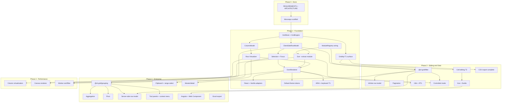

# ol-grid — Implementation Plan & Track

> **Authoritative product spec:** [REQUIREMENTS.md](./REQUIREMENTS.md)  
> **Architecture:** [ARCHITECTURE.md](./ARCHITECTURE.md)  
> **Feature specs:** [requirements/README.md](./requirements/README.md)  
> **Last audited:** 2026-06-18  
> **Tests:** 72 passing (19 files) · **Packages shipped:** 5 (`core`, `dom-renderer`, `sort`, `react`, `vanilla`)

---

## Executive Summary

| Metric | Value |
|--------|-------|
| **Current phase** | **Phase 1 — Foundation (MVP)**, with early Phase 2 spikes (editing, quick filter, CSV) |
| **Tier 1 completion** | **~42%** (core path works; API/a11y/NFR gaps remain) |
| **Tier 2 completion** | **~8%** (editing + quick filter + CSV only) |
| **Tier 3 completion** | **~0%** (specs only) |
| **Overall v1 scope** | **~18%** (weighted across T1–T3) |

**What works today:** A developer can mount a virtualized grid in React or vanilla JS with 1k+ rows, single-column header sort, row selection (single/multi + checkbox column), pinned-left columns, column resize, quick filter, basic inline text editing (dblclick / Enter / F2), arrow-key focus, and CSV export. Monorepo builds with Turbo; Vitest covers store, sort, virtualizer, selection, quick filter, CSV, column model, and edit DOM behavior.

**Critical gaps before Tier 1 exit:** `setSortModel` / custom comparators, right-pinned columns, `aria-sort` + full keyboard nav (Home/End/Page), custom cell renderers, `applyColumnState`, flex column layout bug (Status column in demos), `ModuleRegistry` wiring, axe-core CI, bundle budget gates, 100k-row demo, and API docs.

---

## Phase 0: Done — Scaffold & Specs

| Deliverable | Status | Notes |
|-------------|--------|-------|
| pnpm + Turbo monorepo | Done | `package.json`, `turbo.json`, `vitest.config.ts` |
| `@ol-grid/core` package | Done | `GridEngine`, `GridStore`, `ColumnModel`, `ClientSideRowModel`, sort, selection, virtualizer, CSV, quick filter |
| `@ol-grid/dom-renderer` package | Done | `DomRenderer`, `theme.css`, scroll virtualization, resize, edit host |
| `@ol-grid/react` package | Done | `OlGrid`, `useOlGrid`, `useSyncExternalStore` |
| `@ol-grid/vanilla` package | Done | `createGrid(host, options)` |
| Examples | Done | `examples/react`, `examples/vanilla` — 1k rows, edit, sort, select, quick filter, CSV |
| REQUIREMENTS.md | Done | Tiers, NFRs, exit criteria §8 |
| ARCHITECTURE.md | Done | Layers, packages, phased roadmap §10 |
| 30 feature requirement docs | Done | `requirements/*.md` + index |
| CI / benchmarks / docs site | Not started | No GitHub Actions, no `benchmarks/`, no TypeDoc |

---

## Phase Tracks (ARCHITECTURE.md §10)

### Phase 1 — Foundation (MVP) · **IN PROGRESS (~42%)**

Target: virtualized, sortable, selectable grid; React + vanilla; default theme; core API.

| Workstream | Target packages | Status |
|------------|-----------------|--------|
| GridStore + GridEngine lifecycle | `@ol-grid/core` | Partial — mount/destroy, `setGridOption` subset |
| Column model (defs, pin-left, resize, flex) | `@ol-grid/core` | Partial — no right pin, no groups, flex layout bug |
| CSRM + quick filter | `@ol-grid/core` | Partial — no transactions, no column filters |
| Row virtualization | `@ol-grid/core` + `@ol-grid/dom-renderer` | Partial — fixed height, overscan 5, no `ensureIndexVisible` |
| Sort (single column) | **in core today** (→ `@ol-grid/sort`) | Partial — no comparator, `setSortModel`, multi-sort |
| Selection + focus | `@ol-grid/core` + dom-renderer | Partial — no select-all, shift-range |
| DOM renderer + theme | `@ol-grid/dom-renderer` | Partial — left pin only, no custom renderers |
| React + vanilla adapters | `@ol-grid/react`, `@ol-grid/vanilla` | Partial — options sync subset, no `"use client"` |
| ModuleRegistry skeleton | `@ol-grid/core` | Skeleton — register/has only, not wired to engine |

### Phase 2 — Editing & Data · **NOT STARTED (~8% spikes)**

Target: AG Grid Community parity for admin grids; Vue + Svelte; filtering; infinite row model.

| Workstream | Target packages | Status |
|------------|-----------------|--------|
| Cell editing (full T2) | `@ol-grid/edit` (planned) | Partial in core/dom — text input only |
| Column filters + floating filters | `@ol-grid/filter` | Not started (quick filter in core) |
| Infinite row model | `@ol-grid/infinite-row-model` | Not started |
| Pagination mode | `@ol-grid/pagination` | Not started |
| CSV export (full params) | core / `@ol-grid/export` | Partial — download only |
| Vue + Svelte adapters | `@ol-grid/vue`, `@ol-grid/svelte` | Not started |
| i18n + RTL | `@ol-grid/locale-*` | Not started |
| Controlled mode per state slice | adapters + core | Not started |
| Column groups, drag reorder, auto-size API | `@ol-grid/core` | Partial — auto-size helper exists, not on GridApi |

### Phase 3 — Scale & Enterprise Patterns · **NOT STARTED**

Target: grouping, SSRM, clipboard, tool panels, Angular, Web Component.

| Workstream | Target packages | Status |
|------------|-----------------|--------|
| Row grouping + tree + pivot + agg | `@ol-grid/grouping`, `@ol-grid/pivot` | Spec only |
| Server-side row model | `@ol-grid/server-side-row-model` | Spec only |
| Clipboard + range selection | `@ol-grid/clipboard` | Spec only |
| Context menu + tool panels | `@ol-grid/context-menu`, `@ol-grid/tool-panels` | Spec only |
| Master/detail | `@ol-grid/master-detail` | Spec only |
| Excel export | `@ol-grid/excel-export` | Spec only |
| Angular adapter | `@ol-grid/angular` | Not started |
| Web Component | `@ol-grid/web-component` | Not started |

### Phase 4 — Performance Tier · **NOT STARTED**

Target: canvas renderer, column virtualization, worker offload.

| Workstream | Target packages | Status |
|------------|-----------------|--------|
| Canvas renderer + companion a11y DOM | `@ol-grid/canvas-renderer` | Spec only |
| Column virtualization (500+ cols) | core + renderers | Not started |
| Web Worker sort/filter | `@ol-grid/core` worker entry | Not started |

---

## Per-Feature Status (All 30)

| Feature | Tier | Requirement doc | Status | Key REQ gaps | Next actions | Package |
|---------|------|-----------------|--------|--------------|--------------|---------|
| Core engine | T1–T3 | [core-engine.md](./requirements/core-engine.md) | **Partial** | `ModuleRegistry` not wired; no pipeline plugin hooks; `columnApi` null; missing `applyTransaction` | Wire modules to engine init; add `PluginHost` stub; expand `setGridOption` | `@ol-grid/core` |
| Grid API & events | T1–T3 | [grid-api-and-events.md](./requirements/grid-api-and-events.md) | **Partial** | No `setSortModel`/`getSortModel`, `applyColumnState`, `addEventListener`, `defaultColDef`, controlled slices | Implement API-GA-* T1 methods; dual subscribe API | `@ol-grid/core` |
| Plugin & module system | T1–T3 | [plugin-module-system.md](./requirements/plugin-module-system.md) | **Partial** | MOD-REG-05–08 per-grid scope; no module hooks into pipeline; sort still inlined in core | Extract sort to `@ol-grid/sort`; engine calls `ModuleRegistry` on create | `@ol-grid/core`, `@ol-grid/*` |
| Column model | T1–T2 | [column-model.md](./requirements/column-model.md) | **Partial** | REQ-COL right pin; column groups; `applyColumnState`; flex layout bug on last center column | Fix flex viewport math; add pinned-right region; expose `autoSizeColumn` on API | `@ol-grid/core` |
| Client-side row model | T1–T2 | [client-side-row-model.md](./requirements/client-side-row-model.md) | **Partial** | REQ-CSRM transactions; immutable mode; filter→sort pipeline incomplete (no column filter stage) | `applyTransaction`; formal pipeline stage registry | `@ol-grid/core` |
| DOM renderer | T1–T3 | [dom-renderer.md](./requirements/dom-renderer.md) | **Partial** | DR-CELL custom renderers; right pin; overlays; `aria-sort`; `getCellHost` for portals | Add `aria-sort` on headers; custom renderer host API | `@ol-grid/dom-renderer` |
| Virtualization | T1–T3 | [virtualization.md](./requirements/virtualization.md) | **Partial** | VIRT right pin; `ensureIndexVisible`; dynamic row height; column virt (T3) | `scrollToIndex` API; dynamic height cache (T2) | `@ol-grid/core`, renderers |
| Sorting | T1–T3 | [sorting.md](./requirements/sorting.md) | **Partial** | REQ-SORT comparator; multi-sort; `setSortModel`/`getSortModel` on API; package split | Add `comparator` to `ColumnDef`; imperative sort API; extract `@ol-grid/sort` | **core today** → `@ol-grid/sort` |
| Selection | T1–T2 | [selection.md](./requirements/selection.md) | **Partial** | Select-all header checkbox; shift-click range; `selectAll`/`deselectAll` API | Header checkbox + filtered-aware select-all (T2) | `@ol-grid/core` |
| Keyboard navigation | T1–T3 | [keyboard-navigation.md](./requirements/keyboard-navigation.md) | **Partial** | Home/End, Page Up/Down, Tab between cells, Space toggles selection | Implement KB-T1 keys in dom-renderer | `@ol-grid/core`, dom-renderer |
| Theming | T1–T2 | [theming.md](./requirements/theming.md) | **Partial** | Alpine theme package; dark mode; `prefers-color-scheme`; separate `@ol-grid/themes` | Split `theme.css`; add dark tokens + system mode | `@ol-grid/dom-renderer`, `@ol-grid/themes` |
| Framework adapters | T1–T3 | [framework-adapters.md](./requirements/framework-adapters.md) | **Partial** | Vue/Svelte/Angular/WC; framework cell renderers; controlled mode; `"use client"` | Complete React options sync; add `"use client"`; portal map for cell renderers | `@ol-grid/react`, `@ol-grid/vanilla`, … |
| Accessibility | T1–T3 | [accessibility.md](./requirements/accessibility.md) | **Partial** | axe-core CI; live regions; WCAG AA audit; canvas companion DOM (T3) | Add axe to CI on default demo; focus ring tokens | core + renderers |
| Performance & bundle | T1–T3 | [performance-and-bundle.md](./requirements/performance-and-bundle.md) | **Not started** | No benchmark suite; no gzip CI gates; 100k demo unverified | `benchmarks/` workspace; size-limit in CI | all packages |
| AG Grid migration | T1–T3 | [ag-grid-migration.md](./requirements/ag-grid-migration.md) | **Not started** | No `@ol-grid/compat-ag-grid`; no migration guide | Mapping doc + compat shim after API stabilizes | `@ol-grid/compat-ag-grid` (planned) |
| Cell editing | T2 | [cell-editing.md](./requirements/cell-editing.md) | **Partial** | `valueParser`; Tab navigation; provided editors; validation; custom editors | Tab/Shift+Tab; `valueParser` on ColumnDef; number/select editors | core + dom (→ `@ol-grid/edit`) |
| Filtering | T2–T3 | [filtering.md](./requirements/filtering.md) | **Partial** | Column text/number/date filters; `filterModel`; floating filters; `@ol-grid/filter` package | Create `@ol-grid/filter`; filter UI in header menu | `@ol-grid/filter` |
| Infinite row model | T2 | [infinite-row-model.md](./requirements/infinite-row-model.md) | **Not started** | Datasource contract; LRU block cache; loading stubs | New package + demo against mock REST | `@ol-grid/infinite-row-model` |
| Pagination | T2 | [pagination.md](./requirements/pagination.md) | **Not started** | Client pagination as alternative to virtual scroll | Pagination pipeline stage + footer UI | `@ol-grid/pagination` |
| Export (CSV/Excel) | T2–T3 | [export.md](./requirements/export.md) | **Partial** | `getDataAsCsv`, `onlySelected`, callbacks; Excel module | Complete REQ-EX T2 params; plan Excel dep (OQ-EX-01) | `@ol-grid/core` (CSV), `@ol-grid/excel-export` |
| Internationalization | T2 | [internationalization.md](./requirements/internationalization.md) | **Not started** | `localeText`; RTL; no hard-coded strings in core | `@ol-grid/locale-en` bundle; RTL in dom-renderer | `@ol-grid/locale-*` |
| Clipboard | T2–T3 | [clipboard.md](./requirements/clipboard.md) | **Not started** | Ctrl+C/V; TSV/HTML; range selection dependency | Depends on range selection (T3); basic copy T2 | `@ol-grid/clipboard` |
| Row grouping | T3 | [row-grouping.md](./requirements/row-grouping.md) | **Not started** | Full REQ-RG-* pipeline stage | `@ol-grid/grouping` after CSRM pipeline extensible | `@ol-grid/grouping` |
| Tree data | T3 | [tree-data.md](./requirements/tree-data.md) | **Not started** | `getDataPath`, expand/collapse | Share grouping infra; path-based tree builder | `@ol-grid/grouping` |
| Aggregation | T3 | [aggregation.md](./requirements/aggregation.md) | **Not started** | sum/avg/min/max/count; group footers | Colocate with grouping module (OQ-AG-1) | `@ol-grid/grouping` |
| Pivoting | T3 | [pivoting.md](./requirements/pivoting.md) | **Not started** | Dynamic pivot columns; SSRM metadata | After grouping + column model dynamic cols | `@ol-grid/grouping` / `@ol-grid/pivot` |
| Server-side row model | T3 | [server-side-row-model.md](./requirements/server-side-row-model.md) | **Not started** | Lazy hierarchy; sparse store; stale response tokens | New package; mock server demo | `@ol-grid/server-side-row-model` |
| Context menu & tool panels | T3 | [context-menu-and-tool-panels.md](./requirements/context-menu-and-tool-panels.md) | **Not started** | Column/filter side panels; context menu plugin | `GridPlugin` host; sidebar UI | `@ol-grid/context-menu`, `@ol-grid/tool-panels` |
| Master/detail | T3 | [master-detail.md](./requirements/master-detail.md) | **Not started** | Nested grid; full-width detail rows | Dynamic row heights + nested engine lifecycle | `@ol-grid/master-detail` |
| Canvas renderer | T3 | [canvas-renderer.md](./requirements/canvas-renderer.md) | **Not started** | `drawCell` contract; hidden a11y DOM | Phase 4; benchmark 1M rows | `@ol-grid/canvas-renderer` |

---

## Dependency Graph

What blocks what — build in this order within each phase.

---

## Recommended Sprint Order

Assuming **2-week sprints**, one engineer (scale tasks horizontally when team grows).

### Sprint 1 — Tier 1 API & sort completeness
- [x] `setSortModel` / `getSortModel` on `GridApi` (REQ-SORT-04, T1-SORT-04)
- [x] `comparator` on `ColumnDef` + tests (T1-SORT-03)
- [x] `aria-sort` on column headers + sort indicator tests (T1-SORT-02)
- [x] `defaultColDef` merge (API-GO-06)
- [x] Fix **flex column layout** — Status column in demos should fill remaining center viewport (column-model viewport + dom-renderer width sync)

### Sprint 2 — Keyboard, focus, column state
- [x] Home / End / Page Up / Page Down (T1-SEL-03, A11Y-KB-*)
- [x] `ensureIndexVisible` when focus moves off-screen
- [x] `applyColumnState` / `getColumnState` on `GridApi` (T1-COL-06)
- [x] Pinned-**right** column region (T1-COL pin parity)
- [x] Header checkbox select-all (selection T1 polish)

### Sprint 3 — Renderers, modules, quality gates
- [x] Extract sort to `@ol-grid/sort`; wire `ModuleRegistry` on engine create (MOD-REG-*)
- [x] Custom cell renderer host + string key registry (T1-COL-05)
- [x] React framework cell renderer portal map (REQ-ADP-43)
- [x] `benchmarks/` + 100k-row example (T1-C-02 exit criteria)
- [x] axe-core on default demo in CI (T1 exit §8.1)
- [x] Bundle size gate: core + dom + react gzip ≤ 80 KB (T1-P-04)

### Sprint 4 — Editing T2 completion
- [x] `valueParser` on `ColumnDef`; validation / reject commit (T2-ED-03/04)
- [x] Tab / Shift+Tab between editable cells (T2-ED-02)
- [x] Provided editors: number, select (T2-ED-05)
- [x] `stopEditingWhenCellsLoseFocus`; polish `suppressEditorBlur` path (recent blur-on-rerender fix)
- [x] Editable grid demo as Tier 2 exit artifact (§8.2)

### Sprint 5 — Filtering package
- [x] Create `@ol-grid/filter` package
- [x] Text / number / date column filters (T2-FL-01)
- [x] `setFilterModel` / `getFilterModel` (T2-FL-06)
- [x] Filter UI in column header menu (T2-FL-02)
- [x] Floating filter row (T2-FL-03, Should)

### Sprint 6 — Data loading & export
- [ ] `applyTransaction` on CSRM (T2-DM-03)
- [ ] `@ol-grid/infinite-row-model` + mock REST demo (T2-DM-01/02)
- [ ] CSV: `getDataAsCsv`, `onlySelected`, `processCellCallback` (REQ-EX-*)
- [ ] Loading / error overlays in dom-renderer (T2-DM-05)

### Sprint 7 — Multi-framework & controlled mode
- [ ] `@ol-grid/vue` composable + component (T2-AD-01)
- [ ] `@ol-grid/svelte` component + `bind:api` (T2-AD-02)
- [ ] Controlled `sortModel`, `filterModel`, `rowSelection` (T2-AD-03, REQ-ADP-30–33)
- [ ] `"use client"` on React build (NFR-E-04)

### Sprint 8 — Columns T2 & i18n
- [ ] Column groups (nested headers) (T2-COL-01)
- [ ] Column drag reorder (T2-COL-02, Should)
- [ ] `autoSizeAllColumns` / `sizeColumnsToFit` on API (T2-COL-03)
- [ ] `@ol-grid/locale-en`; `localeText` overrides (T2-I18N-*)
- [ ] Dark mode + `prefers-color-scheme` (T1-TH-01 completion)

### Sprint 9 — Tier 2 exit & docs
- [ ] Multi-column sort (T2-COL-05)
- [ ] Client pagination mode (T2-PG-01)
- [ ] Migration guide draft (§8.2)
- [ ] TypeDoc for `GridOptions` / `GridApi` (NFR-Q-04)
- [ ] Visual regression baseline (NFR-Q-03, Should)
- [ ] **Tier 2 exit checklist** (§8.2 below)

### Sprints 10–14 — Tier 3 core data (grouping → SSRM)
- [ ] `@ol-grid/grouping`: row group pipeline, auto group column, expand/collapse
- [ ] Aggregation functions + group footers
- [ ] Tree data (`getDataPath`)
- [ ] Pivot mode (dynamic columns)
- [ ] `@ol-grid/server-side-row-model` + mock server demo

### Sprints 15–18 — Tier 3 interaction & platform
- [ ] Cell range selection + `@ol-grid/clipboard`
- [ ] Context menu + column/filter tool panels
- [ ] Master/detail module
- [ ] `@ol-grid/excel-export` (resolve OQ-EX-01)
- [ ] `@ol-grid/angular` + `@ol-grid/web-component`

### Sprints 19–20 — Phase 4 performance
- [ ] Column virtualization (500+ columns)
- [ ] `@ol-grid/canvas-renderer` + 1M row benchmark
- [ ] Web Worker sort/filter offload for 100k+ CSRM

---

## Done vs Requirements — Tier Exit Checklists (REQUIREMENTS.md §8)

### §8.1 Tier 1 exit criteria

| Criterion | Status |
|-----------|--------|
| React and vanilla examples run sorting, selection, virtualization on **100k rows** | **Partial** — examples use 1k rows; virtualizer supports 100k but not benchmarked |
| axe-core reports **zero critical** violations on default demo | **Not started** |
| Bundle budget met (§5.2) — core ≤40 KB, react+dom+sort ≤80 KB gzip | **Not measured** |
| API docs cover `GridOptions`, `GridApi`, and all Tier 1 events | **Not started** |
| AG Grid getting-started tutorial reproducible with ≤20% API mapping changes | **Not started** |

### §8.2 Tier 2 exit criteria

| Criterion | Status |
|-----------|--------|
| Editable grid demo with validation and Tab navigation between cells | **Done** — vanilla + React demos with valueParser, valueSetter, number/select editors, Tab nav |
| Infinite row model demo against mock REST API | **Not started** |
| Vue and Svelte examples at parity with React basic demo | **Not started** |
| CSV export matches displayed (filtered/sorted) data | **Done** — uses `getAllFilteredNodes()` |
| Migration guide published with side-by-side AG Grid ↔ ol-grid snippets | **Not started** |

### §8.3 Tier 3 exit criteria

| Criterion | Status |
|-----------|--------|
| Group + aggregate + pivot demo on 50k row client dataset | **Not started** |
| SSRM demo with expandable groups from mock server | **Not started** |
| Clipboard round-trip with Excel verified manually | **Not started** |
| Angular + Web Component examples shipped | **Not started** |
| Canvas renderer benchmark: 1M rows at 60 fps read-only scroll | **Not started** |

---

## Risk Register (Top 5)

| # | Risk | Impact | Likelihood | Mitigation |
|---|------|--------|------------|------------|
| R1 | **Sort/filter remain inlined in core** — blocks tree-shaking and bundle budget | High | High | Sprint 3: extract `@ol-grid/sort`; gate bundle size in CI before adding more features |
| R2 | **Flex / viewport column math bugs** — broken layouts on resize and pinned columns | Medium | High | Sprint 1 fix + column-model integration tests with ResizeObserver scenarios |
| R3 | **Framework cell renderers deferred** — React/Vue apps cannot use component columns | High | Medium | Sprint 3 portal map; document interim string/HTML renderers |
| R4 | **No perf/a11y CI** — regressions ship silently | High | High | Sprint 3: axe + 100k benchmark; fail CI on critical a11y or >10% perf regression |
| R5 | **Tier 3 scope creep** (grouping + pivot + SSRM + clipboard) | High | Medium | Strict phase gates; ship grouping before pivot; SSRM after CSRM pipeline is plugin-ready |

---

## Open Decisions

Consolidated from [REQUIREMENTS.md §9](./REQUIREMENTS.md#9-open-questions), [ARCHITECTURE.md Appendix B](./ARCHITECTURE.md#appendix-b-open-decisions), and feature docs.

| ID | Question | Options | Recommendation | Deadline |
|----|----------|---------|----------------|----------|
| OQ-1 | Tier 3 license model | MIT only / dual commercial | MIT for all data features v1 | Before Tier 3 |
| OQ-2 | Excel export library | SheetJS / ExcelJS / custom | SheetJS or ExcelJS — evaluate gzip (OQ-EX-01) | Tier 3 planning |
| OQ-3 | State library in core | Custom store / `@tanstack/store` | **Custom store** (already implemented); revisit if subscription perf issues | Resolved unless perf forces change |
| OQ-4 | Set filter tier | Tier 2 / Tier 3 | **Tier 3** per REQUIREMENTS matrix; text/number/date in T2 | Tier 2 planning |
| OQ-5 | Nuxt / Next.js wrappers | Community / first-party | Community first (OQ-ADP-01) | Post Tier 2 |
| OQ-6 | AG Grid theme compat (Quartz) | Full / Alpine-only / none | **Alpine-inspired only** v1; default + dark tokens | Tier 2 theming |
| OQ-EX-02 | CSV in core vs package | Split / keep in core | Keep in core (small, zero-dep) | — |
| OQ-AG-1 | Separate `@ol-grid/aggregation`? | Monolith / split | Start in `@ol-grid/grouping`; split if bundle > budget | Tier 3a |
| OQ-RG-1 | Hide grouped columns by default? | AG Grid default / show | Match AG Grid (hide) | Tier 3a |
| OQ-MD-1 | Master expand column placement | First / auto / dedicated | Auto column when module active | Tier 3b |
| OQ-ADP-02 | Native adapters vs WC-primary | Native / WC | Native primary; WC for embed | — |
| ARCH-B | Web Component impl | Lit / vanilla CE | Lit in `@ol-grid/web-component` only | Tier 3 |
| ARCH-C | Default row height | Fixed / dynamic | Fixed 32px default; `getRowHeight` T2 | — |

---

## Implementation Audit Notes (2026-06-18)

Accurate snapshot of `packages/` for planners:

| Area | Built | Not built / gaps |
|------|-------|------------------|
| **Packages** | `core`, `dom-renderer`, `react`, `vanilla` (4) | 20+ planned packages from ARCHITECTURE.md §5 |
| **Sort** | In `core/src/sort/` — toggle, compare, CSRM `applySort` | `@ol-grid/sort` package; multi-sort; `setSortModel` API; `comparator` |
| **Filter** | Quick filter only in `core/src/filter/quick-filter.ts` | Column filters; `@ol-grid/filter`; floating filters |
| **Edit** | Text input, dblclick, Enter/F2/Escape, `suppressEditorBlur` on re-render | `valueParser`; Tab nav; custom editors; `@ol-grid/edit` |
| **Selection** | single/multi, checkbox col, Ctrl+click | select-all; shift range; range selection |
| **Virtualization** | `computeRowVirtualRange`, row recycling, translateY | right pin; column virt; dynamic height; `ensureIndexVisible` |
| **Column model** | flex distribution, pin-left, resize, auto-size helper | flex **layout bug** on Status column in demos; pin-right; groups |
| **CSV** | `generateCsv`, `exportDataAsCsv`, filtered row scope | `getDataAsCsv`, export params, Excel |
| **Tests** | 31 unit/integration tests, 8 files | No adapter integration tests; no a11y tests; coverage << 90% target |
| **Examples** | React + vanilla, 1k rows | 100k perf demo; Vue/Svelte/Angular |

---

## Changelog

| Date | Change |
|------|--------|
| 2026-06-18 | Initial PLAN.md from codebase + requirements audit |
| 2026-06-18 | Restored PLAN.md after accidental deletion |
