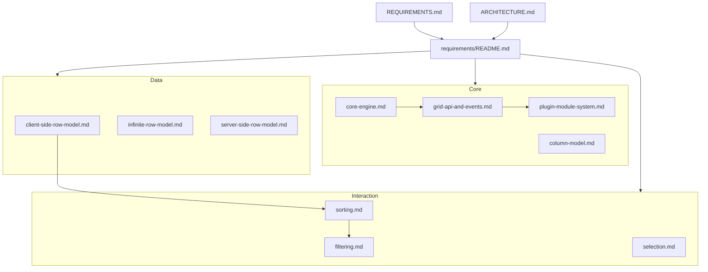

# ol-grid Feature Requirements Index

> Detailed feature specifications for ol-grid v1.  
> **Authoritative product spec:** [REQUIREMENTS.md](../REQUIREMENTS.md)  
> **Implementation architecture:** [ARCHITECTURE.md](../ARCHITECTURE.md)

**Last updated:** 2026-06-18  
**Document count:** 31 feature specs (+ `_template.md`)

---

## Purpose

This folder contains **feature-level requirement documents** that expand [REQUIREMENTS.md](../REQUIREMENTS.md) into implementable specs. Each doc follows a common structure (see [`_template.md`](./_template.md)) with functional requirements, API surfaces, acceptance criteria, and AG Grid migration notes where relevant.

**Implementation track:** [PLAN.md](../PLAN.md) — phased roadmap, per-feature status (all 30 specs), sprint order, tier exit checklists, dependency graph, risks, and open decisions. Updated from codebase audits.

| Document | Role |
|----------|------|
| [REQUIREMENTS.md](../REQUIREMENTS.md) | **What** the product must deliver — vision, tier matrix, NFR summary, success criteria |
| [ARCHITECTURE.md](../ARCHITECTURE.md) | **How** it is built — layers, packages, algorithms, testing strategy |
| [PLAN.md](../PLAN.md) | **When & status** — implementation plan, sprint order, done vs exit criteria |
| `requirements/*.md` | **Feature slices** — enough detail for engineering, QA, and technical writers |

**Hierarchy:** If a feature doc conflicts with REQUIREMENTS.md, REQUIREMENTS.md wins. If a feature doc conflicts with ARCHITECTURE.md on implementation, amend the feature doc or escalate via REQUIREMENTS.md amendment.

---

## Tier Legend

| Tier | Phase | Goal |
|------|-------|------|
| **T1** | Foundation (MVP) | Virtualized, sortable, selectable grid; React + vanilla; core API |
| **T2** | Editing & multi-framework | AG Grid Community parity for typical admin grids; Vue + Svelte |
| **T3** | Enterprise patterns & scale | Grouping, SSRM, clipboard, tool panels; Angular + Web Component + canvas |

---

## Feature Documents by Category

### Core

| Document | Summary | Tier | Package(s) | Status |
|----------|---------|------|------------|--------|
| [core-engine.md](./core-engine.md) | `GridEngine`, `GridStore`, lifecycle, headless logic boundaries | T1–T3 | `@ol-grid/core` | Partial |
| [grid-api-and-events.md](./grid-api-and-events.md) | `GridOptions`, `GridApi`, `ColDef`, dual callback/subscribe API, event catalog | T1–T3 | `@ol-grid/core` | Partial |
| [plugin-module-system.md](./plugin-module-system.md) | `ModuleRegistry`, `GridModule`, `GridPlugin`, tree-shaking | T1–T3 | `@ol-grid/*` | Skeleton |
| [column-model.md](./column-model.md) | Column defs, state, pin, resize, groups, value pipeline | T1–T2 | `@ol-grid/core` | Partial |

### Data

| Document | Summary | Tier | Package(s) | Status |
|----------|---------|------|------------|--------|
| [client-side-row-model.md](./client-side-row-model.md) | CSRM pipeline, filter→sort→group stages, transactions | T1–T2 | `@ol-grid/core` | Partial |
| [infinite-row-model.md](./infinite-row-model.md) | Block loading, LRU cache, datasource contract | T2 | `@ol-grid/infinite-row-model` | Not started |
| [server-side-row-model.md](./server-side-row-model.md) | Lazy hierarchy, sparse store, server sort/filter | T3 | `@ol-grid/server-side-row-model` | Not started |
| [row-grouping.md](./row-grouping.md) | Group by column, expand/collapse, group row renderer | T3 | `@ol-grid/grouping` | Not started |
| [tree-data.md](./tree-data.md) | Hierarchical rows via `getDataPath` | T3 | `@ol-grid/grouping` | Not started |
| [master-detail.md](./master-detail.md) | Expandable nested detail grids | T3 | `@ol-grid/master-detail` | Not started |

### Interaction

| Document | Summary | Tier | Package(s) | Status |
|----------|---------|------|------------|--------|
| [sorting.md](./sorting.md) | Header sort, comparators, multi-sort, SSRM pass-through | T1–T3 | `@ol-grid/sort` | Partial (in core) |
| [filtering.md](./filtering.md) | Column filters, floating filters, quick filter, set filter | T2–T3 | `@ol-grid/filter` | Not started |
| [selection.md](./selection.md) | Row selection, checkbox column, select-all | T1–T2 | `@ol-grid/core` | Partial |
| [keyboard-navigation.md](./keyboard-navigation.md) | Arrow/Home/End nav, focus model, grid pattern | T1–T3 | `@ol-grid/core` | Partial |
| [cell-editing.md](./cell-editing.md) | Inline edit, editors, commit/cancel, validation | T2 | `@ol-grid/edit` | Partial |
| [pagination.md](./pagination.md) | Client pagination mode (alternative to virtual scroll) | T2 | `@ol-grid/pagination` | Not started |
| [clipboard.md](./clipboard.md) | Copy/paste TSV+HTML, range selection integration | T2–T3 | `@ol-grid/clipboard` | Not started |
| [context-menu-and-tool-panels.md](./context-menu-and-tool-panels.md) | Context menu, side bar, columns/filters panels | T3 | `@ol-grid/context-menu`, `@ol-grid/tool-panels` | Not started |

### Analytics

| Document | Summary | Tier | Package(s) | Status |
|----------|---------|------|------------|--------|
| [aggregation.md](./aggregation.md) | sum, avg, min, max, count, custom agg functions | T3 | `@ol-grid/grouping` | Not started |
| [pivoting.md](./pivoting.md) | Pivot mode, pivot columns from unique values | T3 | `@ol-grid/pivot` | Not started |

### Rendering

| Document | Summary | Tier | Package(s) | Status |
|----------|---------|------|------------|--------|
| [dom-renderer.md](./dom-renderer.md) | Default DOM renderer, headers, cells, scroll containers | T1–T3 | `@ol-grid/dom-renderer` | Partial |
| [canvas-renderer.md](./canvas-renderer.md) | Canvas paint path, companion a11y DOM | T3 | `@ol-grid/canvas-renderer` | Not started |
| [virtualization.md](./virtualization.md) | Row/column virtualizer, overscan, dynamic height | T1–T3 | `@ol-grid/core` | Partial |
| [theming.md](./theming.md) | CSS tokens, light/dark, Alpine-inspired theme | T1–T2 | `@ol-grid/themes` | Partial |

### Platform

| Document | Summary | Tier | Package(s) | Status |
|----------|---------|------|------------|--------|
| [framework-adapters.md](./framework-adapters.md) | React, Vue, Svelte, Angular, vanilla, Web Component | T1–T3 | `@ol-grid/react`, etc. | Partial (React/vanilla) |
| [export.md](./export.md) | CSV download, Excel `.xlsx`, export callbacks | T2–T3 | `@ol-grid/export`, `@ol-grid/excel-export` | Partial (CSV in core) |
| [internationalization.md](./internationalization.md) | Locale bundles, `localeText`, RTL, formatted values | T2 | `@ol-grid/locale-*` | Not started |
| [accessibility.md](./accessibility.md) | WAI-ARIA grid, keyboard, WCAG 2.1 AA, screen reader | T1–T3 | core + renderers | Partial |

### NFR (Non-Functional Requirements)

| Document | Summary | Tier | Package(s) | Status |
|----------|---------|------|------------|--------|
| [performance-and-bundle.md](./performance-and-bundle.md) | FPS targets, bundle budgets, benchmark suite, CI gates | T1–T3 | all packages | Draft |

### Migration

| Document | Summary | Tier | Package(s) | Status |
|----------|---------|------|------------|--------|
| [ag-grid-migration.md](./ag-grid-migration.md) | Compat shim, ColDef/API mapping, migration guide deliverables | T1–T3 | `@ol-grid/compat-ag-grid` | Draft |

---

## Tier × Feature Matrix

Cross-reference of **feature areas** (rows) vs **delivery tier** (columns). ✅ = primary tier; ○ = partial / dependency only.

| Feature area | T1 | T2 | T3 | Requirement doc |
|--------------|:--:|:--:|:--:|-----------------|
| Core engine / GridStore | ✅ | ○ | ○ | [core-engine.md](./core-engine.md) |
| GridOptions / GridApi / Events | ✅ | ○ | ○ | [grid-api-and-events.md](./grid-api-and-events.md) |
| ModuleRegistry / plugins | ✅ | ○ | ○ | [plugin-module-system.md](./plugin-module-system.md) |
| Column model | ✅ | ✅ | ○ | [column-model.md](./column-model.md) |
| Client-side row model | ✅ | ○ | ○ | [client-side-row-model.md](./client-side-row-model.md) |
| DOM renderer | ✅ | ○ | ○ | [dom-renderer.md](./dom-renderer.md) |
| Row virtualization | ✅ | ○ | ○ | [virtualization.md](./virtualization.md) |
| Sorting | ✅ | ○ | ○ | [sorting.md](./sorting.md) |
| Selection & keyboard nav | ✅ | ○ | ○ | [selection.md](./selection.md), [keyboard-navigation.md](./keyboard-navigation.md) |
| Theming | ✅ | ○ | | [theming.md](./theming.md) |
| React + vanilla adapters | ✅ | | | [framework-adapters.md](./framework-adapters.md) |
| Performance & bundle NFRs | ✅ | ✅ | ✅ | [performance-and-bundle.md](./performance-and-bundle.md) |
| Accessibility (base) | ✅ | ✅ | ○ | [accessibility.md](./accessibility.md) |
| AG Grid migration | ○ | ✅ | ○ | [ag-grid-migration.md](./ag-grid-migration.md) |
| Cell editing | | ✅ | ○ | [cell-editing.md](./cell-editing.md) |
| Filtering | | ✅ | ○ | [filtering.md](./filtering.md) |
| Infinite row model | | ✅ | | [infinite-row-model.md](./infinite-row-model.md) |
| Pagination | | ✅ | | [pagination.md](./pagination.md) |
| CSV export | | ✅ | | [export.md](./export.md) |
| Vue + Svelte adapters | | ✅ | | [framework-adapters.md](./framework-adapters.md) |
| i18n / RTL | | ✅ | | [internationalization.md](./internationalization.md) |
| Row grouping / tree | | | ✅ | [row-grouping.md](./row-grouping.md), [tree-data.md](./tree-data.md) |
| Aggregation / pivot | | | ✅ | [aggregation.md](./aggregation.md), [pivoting.md](./pivoting.md) |
| SSRM | | | ✅ | [server-side-row-model.md](./server-side-row-model.md) |
| Clipboard / range selection | | ○ | ✅ | [clipboard.md](./clipboard.md) |
| Excel export | | | ✅ | [export.md](./export.md) |
| Context menu / tool panels | | | ✅ | [context-menu-and-tool-panels.md](./context-menu-and-tool-panels.md) |
| Master/detail | | | ✅ | [master-detail.md](./master-detail.md) |
| Canvas renderer / column virt | | | ✅ | [canvas-renderer.md](./canvas-renderer.md), [virtualization.md](./virtualization.md) |
| Angular + Web Component | | | ✅ | [framework-adapters.md](./framework-adapters.md) |

---

## Implementation Status Summary

| Status | Count | Meaning |
|--------|-------|---------|
| **Partial** | 12 | Some code exists in `packages/`; spec documents gaps |
| **Not started** | 16 | Spec only; no or minimal implementation |
| **Draft** | 3 | Cross-cutting docs (migration, perf, plugin system) |

Docs with **Current Implementation Status** sections: sorting, filtering, selection, keyboard-navigation, cell-editing, clipboard, export, framework-adapters, core-engine, column-model, client-side-row-model, dom-renderer, canvas-renderer, virtualization, theming, accessibility, internationalization, pagination, infinite-row-model, server-side-row-model.

---

## Document Template

New feature specs MUST use [`_template.md`](./_template.md). Mature docs (e.g. [sorting.md](./sorting.md)) extend the template with:

1. **Overview** — scope, goals, non-goals  
2. **Current Implementation Status** — audit table vs `packages/`  
3. **User Stories** — `US-XX` by tier  
4. **Functional Requirements** — `REQ-XX` with Must/Should/Could  
5. **API & Events** — types, GridOptions/GridApi, module registration  
6. **AG Grid Parity** — mapping table  
7. **Acceptance Criteria** — checkbox list per tier exit  
8. **Dependencies**, **Open Questions**, **References**

**ID conventions:**

| Prefix | Domain |
|--------|--------|
| `REQ-*` / `REQ-SORT-*` etc. | Feature functional requirements |
| `API-*` | Grid API & events |
| `MOD-*` | Module system |
| `CM-*` / `TP-*` | Context menu / tool panels |
| `REQ-ADP-*` | Framework adapters |
| `REQ-EX-*` | Export |
| `NFR-*` | Non-functional (see also [performance-and-bundle.md](./performance-and-bundle.md)) |
| `MIG-*` | Migration |
| `T1-*`, `T2-*`, `T3-*` | Cross-refs to REQUIREMENTS.md |

---

## How to Use These Docs

### For engineers

1. Read [REQUIREMENTS.md](../REQUIREMENTS.md) for tier scope and exit criteria.  
2. Read [ARCHITECTURE.md](../ARCHITECTURE.md) for package boundaries and data flow.  
3. Implement against the relevant `requirements/*.md` — acceptance criteria are the definition of done.  
4. Register modules per [plugin-module-system.md](./plugin-module-system.md).  
5. Verify bundle and perf gates in [performance-and-bundle.md](./performance-and-bundle.md).

### For QA

- Tier exit checklists live in REQUIREMENTS.md §8; feature docs add granular acceptance criteria and test plans.  
- AG Grid parity scenarios: [ag-grid-migration.md](./ag-grid-migration.md).

### For technical writers

- Public docs mirror API names from [grid-api-and-events.md](./grid-api-and-events.md).  
- Migration guide structure: [ag-grid-migration.md](./ag-grid-migration.md).

---

## Complete File Inventory

Alphabetical list of all requirement documents (excluding `_template.md`):

| # | File |
|---|------|
| 1 | [accessibility.md](./accessibility.md) |
| 2 | [ag-grid-migration.md](./ag-grid-migration.md) |
| 3 | [aggregation.md](./aggregation.md) |
| 4 | [canvas-renderer.md](./canvas-renderer.md) |
| 5 | [cell-editing.md](./cell-editing.md) |
| 6 | [client-side-row-model.md](./client-side-row-model.md) |
| 7 | [clipboard.md](./clipboard.md) |
| 8 | [column-model.md](./column-model.md) |
| 9 | [context-menu-and-tool-panels.md](./context-menu-and-tool-panels.md) |
| 10 | [core-engine.md](./core-engine.md) |
| 11 | [dom-renderer.md](./dom-renderer.md) |
| 12 | [export.md](./export.md) |
| 13 | [filtering.md](./filtering.md) |
| 14 | [framework-adapters.md](./framework-adapters.md) |
| 15 | [grid-api-and-events.md](./grid-api-and-events.md) |
| 16 | [infinite-row-model.md](./infinite-row-model.md) |
| 17 | [internationalization.md](./internationalization.md) |
| 18 | [keyboard-navigation.md](./keyboard-navigation.md) |
| 19 | [master-detail.md](./master-detail.md) |
| 20 | [pagination.md](./pagination.md) |
| 21 | [performance-and-bundle.md](./performance-and-bundle.md) |
| 22 | [pivoting.md](./pivoting.md) |
| 23 | [plugin-module-system.md](./plugin-module-system.md) |
| 24 | [row-grouping.md](./row-grouping.md) |
| 25 | [selection.md](./selection.md) |
| 26 | [server-side-row-model.md](./server-side-row-model.md) |
| 27 | [sorting.md](./sorting.md) |
| 28 | [theming.md](./theming.md) |
| 29 | [tree-data.md](./tree-data.md) |
| 30 | [virtualization.md](./virtualization.md) |
| — | [README.md](./README.md) (this index) |

**Total:** 31 files (30 feature specs + README). Template: [`_template.md`](./_template.md).

---

## Relationship Diagram

---

## Changelog

| Date | Change |
|------|--------|
| 2026-06-18 | Initial requirements folder: 6 feature docs + template + index |
| 2026-06-18 | Full index refresh: 30 feature specs across 8 categories; added `export.md`, expanded `framework-adapters.md` |
